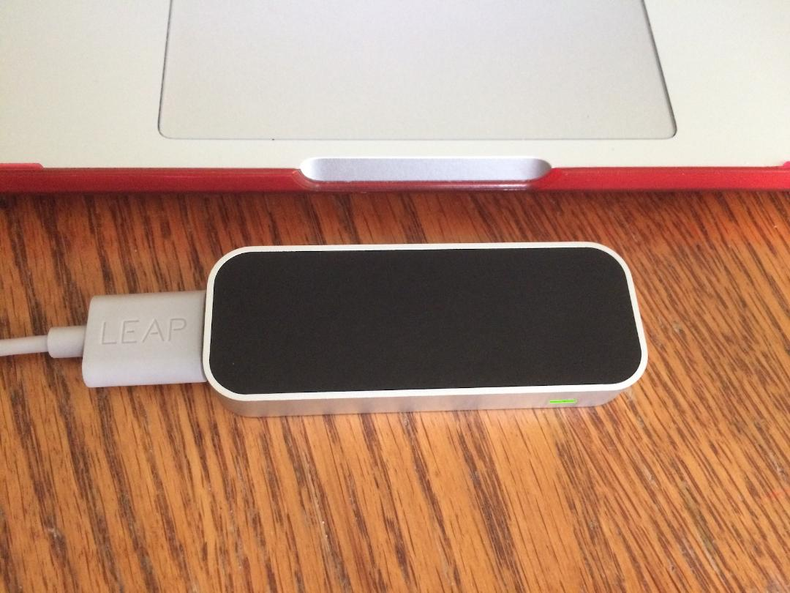
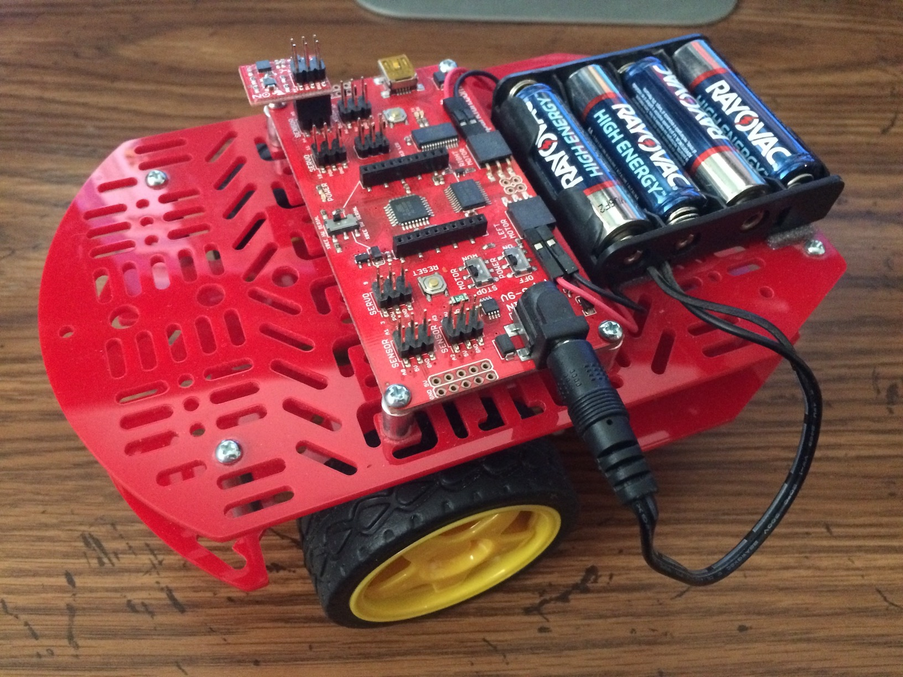
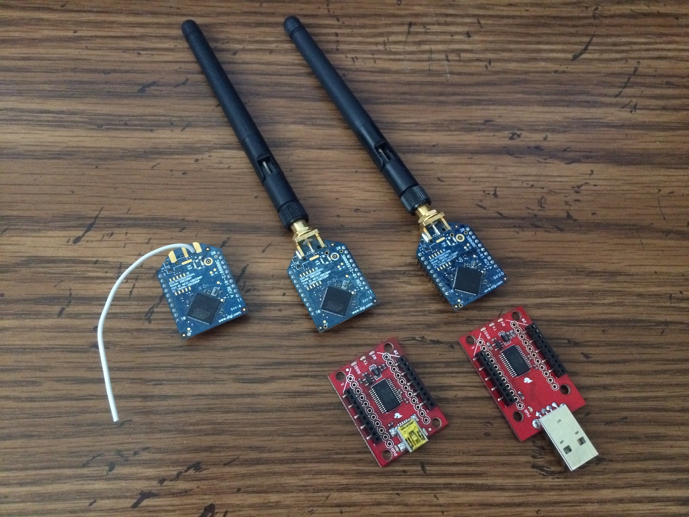
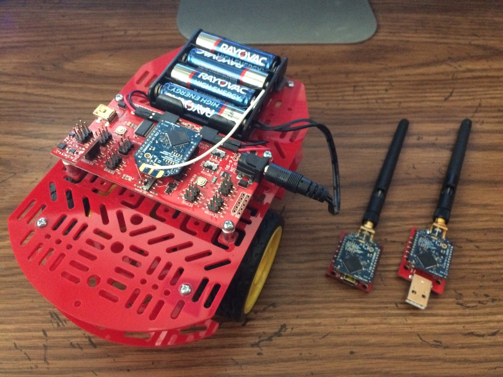
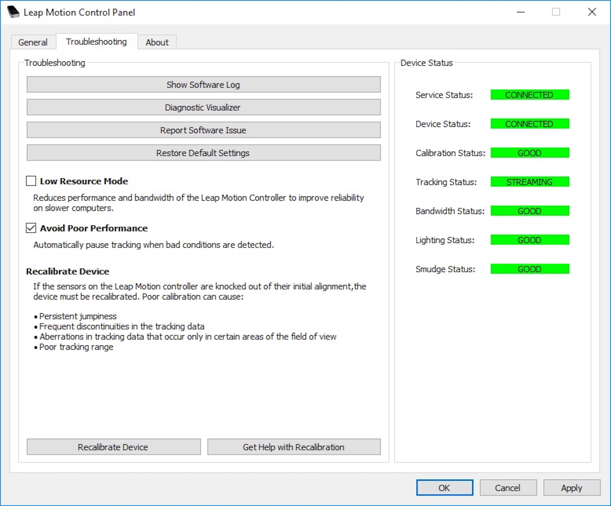
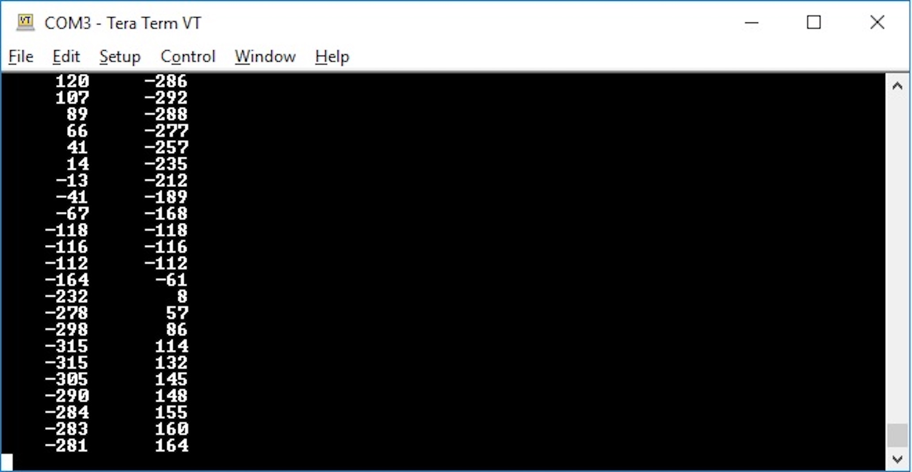

# **Redbot Hands Free Robot Control**

Hands free control of a SparkFun Redbot Robot using Leap Motion's Hand Sensing Controller.

This project is featured on the cover of the January/February 2019 issue of Servo Magazine.

Redbot Hands Free Control
=========================

Introduction
------------

Ever since I first saw the Leap Motion Hand Tracking Controller, I've
been fascinated by the potential of what can be done with this fantastic
device. Leap Motion has not only developed a device that can track your
hands, but through their software, they can tell you every
characteristic about your hands. With great accuracy, they can tell you
every aspect of your left, right, or both hands; they can tell you the
pitch, roll, and yaw of the palm of your hand; they can tell you how
many fingers you have extended along with the length and direction of
each segment of each finger on each hand (including your thumb). With
this device and its accompanying software, you can use your hands as
input devices to control any aspect that is controllable through your
computer. The potential of this device is limitless!

With this in mind, I wanted to start with a simple device that can be
controlled with just hand gestures. This, I'm doing to become familiar
with the use of the Leap Motion Controller along with its software and
to just have some fun. What I came up with is the software that allows
you to control a SparkFun Redbot robot with just your hands in free
space.

The Redbot robot is a basic robot platform that has two wheels where
each one is driven independently along with a third pivot point. So in
order to control this robot, you'll need throttle control for forward
and reverse along with directional control for straight, left or right.
I decided to use a single hand to control the device with the pitch of
the palm to control the throttle and roll for directional control.

And now, how am I communicating with the Redbot? Good thing that you
asked! I just happened to have several Digi XBee wireless RF modules
left over from an early project that should fit the bill. And the best
part is that the controller board on the Redbot is already fitted with
the proper connector to support an XBee module. I just love it when
things work out for the better! In addition to the one XBee module for
the Redbot, I have two others. Both of these modules are mounted on
SparkFun Explorer boards that includes an FTDI to USB chip, so all
you'll have to do is plug the module into the explorer board and then
plug the explorer board into an open USB port on your computer and
you're all set. Now you may ask, why do I need two modules connected to
my computer? Again, good question! We will be using one as a transceiver
to communicate with the XBee module on the Redbot and the second one
that will be used to monitor all communications between the computer and
the Redbot through the use of a serial terminal window.

This article describes the required hardware and software that provides
you with the ability to control a SparkFun Redbot using the Leap Motion
Controller. This article contains the firmware that you will be loading
onto the SparkFun Redbot along with the application that you will be
running on your host computer that allows you to control the robot
without any contact to any device.

Hardware Requirements
---------------------

The hardware requirements consist of the Leap Motion Controller, the
SparkFun Redbot robot, a verity of Digi XBee modules, and the hardware
to support the XBee modules. These requirements are documented in the
following sections.

### Leap Motion Controller

The heart of this project is the Leap Motion Controller as shown in
Figure 1.

Figure 1 Leap Motion Controller

This is the device that will track the movements of your hands and turn
those movements into a format that you can use in your program to
manipulate anything else that is controllable through your computer.
Leap Motion provides the hand tracking controller along with a USB 3
cable. We will get into the details of connecting the controller to your
computer and configuring your computer to be able to interact with this
device a little later.

### SparkFun Redbot

Next, we have the SparkFun Redbot robot development platform. This kit
comes with everything shown in Figure 2 (along with a few items not
shown).

Figure 2 SparkFun Redbot Robot Development Platform

Please be aware that this version of the Redbot is no longer in
production. But the good news is that the differences between this
Redbot and the one currently being sold by SparkFun have no relevance to
what we will be doing in this demonstration.

The best part of this platform is the SparkFun Redbot Mainboard that is
mounted on the top of the robot. This is an Arduino compatible
development board that includes everything that is needed to control
this Redbot including the motor drivers. It also includes multiple IO
ports that can be used to drive servos or other devices along with
monitoring sensors. But the best part is that it comes with the proper
connector for the Digi XBee module that we will be using to remotely
control the robot. In this project, we will be using the Digi XBee
connector along with the motor drivers. But with all of that available
IO, there's lots of room for expansion!

The first thing that you will need to do is to build the Redbot
according to the instructions provided by SparkFun. This is an easy and
fun process and shouldn't take more than an hour or so to complete.

### Digi XBee Modules

The last pieces of hardware that we will need are the Digi XBee RF
Modules as shown in Figure 3.

Figure 3 Digi XBee Pro 900 Modules

What's shown in Figure 3 are three Digi XBee Pro 900 Modules along with
two versions of the SparkFun XBee Explorer USB boards. I have one XBee
module that is using a wire antenna and two that are using the RPSMA
connector with a 900MHz antenna attached to each. For this project,
either antenna configuration will work. As for the explorer boards, one
needs to be plugged into a USB cable whereas the other can be plugged
directly into a USB port on your computer. Again, either will work; the
choice as to which one to use is up to you.

For this project, I've chosen to us the Digi Pro 900 Modules, primarily
because I had these left over from an earlier project. These modules
work on the 900MHz frequency band as opposed to the Digi modules that
you'll normally find that work on the 2.4GHz frequency band.

For this project, you'll need to attach one XBee module to the Redbot
Mainboard's XBee connector and mound the other two XBee modules to the
explorer boards as shown in Figure 4.

Figure 4 Redbot and XBee Modules

Please be aware that there is what I'll call a 'design oversight' with
the Redbot Mainboard. This has to do with the placement of switch S3.
During development, you'll need to change the setting on this switch in
order to load the firmware onto this board and then change the setting
back in order for the firmware to work properly. That is why I'm shown
the XBee Module with the wire antenna mounted on the Redbot. With this
XBee module, you'll have direct access to switch S3 without having to
remove and then remount the module during firmware updates.

As a further note, I'm showing two XBee modules that will be used on the
host side when in reality, you only NEED one. The second module will be
used to monitor the serial data between the Redbot and the host
computer. This makes debugging the software much easier and is well
worth the cost of the additional module when you consider the time that
will be saved.

One thing that I need to inform you about is that Digi supplies a very
good tool for configuring their devices called XCTU. This setup tool
provides you with the ability to upgrade your XBee devices to the latest
firmware. It also allows you to configure the devices to use a baud rate
other than 9600bps which is their default value. I've reconfigured mine
to use 115200bps which is what the firmware on for the Redbot and
application is expecting. You will either need to reconfigure your XBee
devices to use this baud rate or modify the supplied code to use
9600bps.

Software Requirements
---------------------

There are multiple pieces of software that will need to be downloaded
and installed. These include the Arduino IDE along with the SparkFun
plug-in for Arduino, Microsoft Visual Studio Community 2017, git, Leap
Motion Services, and LeapC-Sample. You will also need to download the
software that I developed for this project from github. Details on where
to get and how to install the various software packages are listed
below.

### Microsoft Windows 10

I guess that I should start with the basics and that is that all
development was done using Windows 10. It should be possible to port
everything to either MacOS or Linux for most of what is described here
does have support for those operating systems. So please, have fun in
doing so if you like.

### Arduino IDE

Let's start with the simple stuff first. You will need to install the
Arduino IDE. At the time of this writing, I installed version 1.8.7.
Once you have this installed, you will need to install the SparkFun
plug-in for Arduino. This is a pretty straight forward process and is
well documented on the SparkFun web site. You can start by going to the
following URL which will take you to the SparkFun web site:

[SparkFun Software Installation
Guide](https://learn.sparkfun.com/tutorials/experiment-guide-for-redbot-with-shadow-chassis/experiment-1-software-install-and-basic-test)

Then, just follow the instructions on how to install the Arduino IDE
along with the SparkFun plug-in. Truthfully, they've explained the
process better than I can.

### Visual Studio Community 2017

Visual Studio Community 2017 is a full featured and free version of
Microsoft's Visual Studio IDE. You can download the installer for either
Windows or Mac at the following link:

[Visual Studio Community
2017](https://visualstudio.microsoft.com/vs/community/)

Once you've downloaded the installer, you will need to execute it to
install Visual Studio on your system.

### git

You will first need to install git. git is required in order to clone
the various repositories that are required to build the firmware for the
Redbot and to build the application program. To help you out, here's the
page for git with links to everything that you will need to get going.

[git Installation](https://git-scm.com/)

I'm a big fan of configuration management, so I consider learning git to
be very important in anyone's growth as a software engineer.

### Leap Motion Services

Another piece of software that you will need to install is the Leap
Motion Services. Leap Motion does a great job at defining how to install
their services at the following link.

[Leap Motion Service](https://www.leapmotion.com/setup/)

For this project, you will need to install the Leap Motion Services for
the desktop. Once installed, the service will run in the background and
will only become active once the Leap Motion Controller is plugged into
your host computer. The application that we will be building that runs
on the host computer will interact with this service to get the hand
tracking data. So it is quite important that it is installed and working
properly.

Once you have the Leap Motion Services installed, we can verify that the
host computer can see it and that it is functional. Leap Motion supplies
a USB 3 cable with their controller, so start by plugging the controller
into the USB 3 Micro-A end of the cable and the plug the USB 3 Type-A
connector into an open USB port on your host computer. This does not
necessarily require that the host computer have an open USB 3 port for a
USB 2 port will work as well. Next, you will need to bring up the Leap
Motion Control Panel. You can access this from the hidden icon pop-up
within the Windows Taskbar or by searching for Leap Motion Control Panel
from the task bar as well.

Once the Leap Motion Control Panel is open, click on the Troubleshooting
tab and you should see what's displayed in Figure 6.

Figure 5 Leap Motion Control Panel

First, check the Device Status panel. If everything is green, then we're
good to go. But if you truly want to see what this device is capable of,
click on the Diagnostic Visualizer button and have some fun.

### Leap Motion LeapC-Samples

Please bear with me, we're getting close to the end. The next software
package that needs to be downloaded is the Leap Motion LeapC example
programs that I used as a starting point for this project. You will
first need to go the Leap Motion Github LeapC-samples repository. In an
attempt to make it easy you, I've provided the following link:

[LeapC-samples](https://github.com/leapmotion/LeapC-samples)

If you have git installed as I had suggested earlier, all you'll need to
do is clone the repository. To do this, first bring up a terminal window
and enter the following commands.

    mkdir Development
    cd Development
    git clone https://github.com/leapmotion/LeapC-samples.git

In truth, you probably didn't need to go to github to clone the
repository. But it is nice to see what's there and available for you
use.

### redbot-hands-free-control

And last but not least, you will need to clone my github repository as
well:

    git clone https://github.com/JimInCA/redbot-hands-free-control.git

I know that this was quite a bit, but this should be it for software
installation. Next we will need to configure the software by copying
some code from LeapC to our project.

Software Configuration
----------------------

Now that we have everything that we need to build both the firmware for
the Redbot and for building the host application, we now need to copy
some files from the Leap Motion LeapC samples directory to our
application directory. I've put together a batch file that will
automatically copy the files from the LeapC-samples directory and place
them where Visual Studio expects them to me. Assuming that you cloned
the two directories as defined above, this is all you should need to do:

    cd redbot-hands-free-control
    auto_config.bat

Please take note of the message that gets displayed after the batch file
executes. You will need to make a minor edit to one of the files that
got copied. This is needed in order for the application to build
properly; else, you will get a message about a missing header file. If
you're like me and prefer to use a bash shell, I've also provided a
script to copy the required files. The advantage of this script file is
that it takes advantage of sed to automatically update the file that
needs to be modified. It's a shame, but sed is not available under
Windows.

### Building and Installing the Redbot Firmware

Now that all the work is done, we can finally start to have some fun! To
start with, we will first build the firmware that we will load onto the
SparkFun Redbot. This should be a simple task if the Arduino IDE is set
up as defined above. So open the Arduino IDE and from the File menu,
select open. Once the file browser opens, make your way to
`<path>/redbot-``hands-free``-control/redbot-firmware` and select
\`redbot-firmware.ino' to open the file that has the firmware source
code.

Please feel free to scan through the code to become familiar with what
it is doing. The code is very simple in that the setup() function
initializes the uart and timeout counter. The main work is being done in
the loop() function in that it waits for data to show up on the uart,
reads the data, and then programs the left and right motor with the data
that it receives. If you look closely, you'll also notice that I have a
timeout counter that is intended to prevent the robot from running wild
if it stops receiving data by zeroing out the motor analog values.

So now what we need to do is connect the Redbot to the host computer
through the USB cable connected to the Redbot Mainboard. You should be
familiar with this if you went through the SparkFun Software
Initialization Guide as I had suggested earlier. So once the Redbot
Mainboard is connected to the host, you will need to open the Tools menu
in the Arduino IDE and then scroll down to Boards:... From the pop-up
listing, scroll down and select SparkFun Redbot. You will then need to
repeat the process of opening up the Tools menu, but this time, you will
need to select Ports and then select the proper port that your Redbot is
connected to on your computer. From this point, it should be a simple
matter of selecting Verify/Compile from the Sketch menu and once it
completes, then select Upload from the Sketch menu to load the firmware
onto the Redbot Mainboard.

Please be aware that as I've pointed out earlier, you will need to
change the position on switch S3 to upload the firmware and then switch
it back to its original position once the firmware has completed
uploading.

### Building The Redbot Host Application

All that's left is to build the application that will run on your host
computer that will send the wireless commands to the Redbot by
monitoring your hand movements using the Leap Motion Controller. We'll
start by bringing up Visual Studio Community IDE and opening up the
solution file for the application. So once Visual Studio is up and
running, go to the File menu, scroll down to Open, shift right to open
the sub menu, and select Project/Solution... From the pop-up file
browser, make your way over to the solution file,
`<path>/Development/redbot-hands-free-control/redbot-application/redbot-application.sln`,
select this file, and then press the Open button. If all goes well,
Visual Studio will open up the solution file for this project. Now all
you should need to do is select Build Solution from the Build menu and
Visual Studio will compile, link, and store the application executable
in the `./x64/Release` directory.

Testing Leap Motion Control of Redbot
-------------------------------------

Now it's time to start having some real fun by getting the software and
hardware talking to each other. The first thing that we want to verify
is that our application can connect to both the Leap Motion Controller
and to the XBee RF module. So start by connection the USB cable to both
the Leap Motion Controller and host computer. Next, plug one of the XBee
modules into the SparkFun USB Explorer boards and then connect the board
to a second USB port on your host computer. With everything plugged in,
you will need to find out the serial port being used by the XBee module
which can be done through Window's Device Manager. Once you have all of
this done, you can enter the following on a command line replacing the
serial port that I have shown with the one that you found in Device
Manager. You can also specify a baud rate other than the default value
used by the application.

    <path>\redbot-application>./x64/Release/controller.exe -p COM4 -b 115200
    Successfully connected to UART on port COM4 at baud rate 115200.
    Successfully connected to Leap Motion Controller.
    Using device LP95554261956.

If everything went well, then it's time to see if our application is
sending out any data. We will do this by connecting the second Digi XBee
to your host to monitor the proper RF frequency for all data (or you can
connect the second XBee module on a second computer if you so like). You
will then need to open a terminal program and connect this program to
the second XBee module's serial port. Both Tera Term and HyperTerminal
work well for this, or you can use any other serial terminal that you
prefer. If everything is working, you should see the data that's being
sent from our application by means of its XBee RF module as shown in
Figure 6.

Figure 6 Serial Output to Tera Term

And remember, we want to verify that the Leap Motion Controller is the
source of the data being sent! So hold your left hand about 12 to 18
inches above the controller and verify that the data being presented in
the serial terminal follows the movement of your hand. If you hold your
hand flat, the pair of data (the analog value for left and right motor)
should be close to zero. Then try tilting the palm of your hand
forwards, backwards, to the left, and to the right (±pitch and ±roll).
The data should change as you move your hand.

Now for the ultimate test; it's time to power up the Redbot! On the
Redbot Mainboard, set the motor switch, S2, to the on position. Then
turn on the Redbot Mainboard by sliding S1 to the on position. For the
first test, I'd set the Redbot on its end so that the wheels are in the
air and then place your left hand over the Leap Motion Controller and
verify that the wheels turn in the correct direction following the
movement of the palm of your hand. Once you're satisfied that everything
is working correctly, place the robot on a large flat service and enjoy.

About the Magic
---------------

The real power in this application is what's hidden inside the libraries
supplied to us by Leap Motion. What they provide is a very simple set of
APIs to get access to the hand tracking data. We then use that data to
control the movement of the robot.

Here is the heart of the application code that gets the information from
the controller that we use to determine the pitch and roll of the hand.
We then translate that information into forward or reverse throttle and
left or right direction. Once we've calculated the proper values for the
left and right motor, we then send that data to the Redbot by way of the
XBee RF module.

      while(1)
      {
          LEAP_TRACKING_EVENT *frame = GetFrame();
          if(frame && (frame->tracking_frame_id > lastFrameID))
          {
              lastFrameID = frame->tracking_frame_id;
              for(uint32_t h = 0; h < frame->nHands; h++)
              {
                  LEAP_HAND* hand = &frame->pHands[h];
                  LEAP_VECTOR* vector = &hand->palm.normal;
                  if (hand->type == eLeapHandType_Left)
                  {
                      // pitch will be used for throttle forward or reverse
                      pitch = get_pitch(vector) + (float)90.0;
                      pitch *= GAIN;
                      // roll will be used for turning left or right 
                      roll = get_roll(vector);
                      roll *= GAIN * (float)0.5;
                      // calculate values for left and right motors
                      int32_t left_motor = (int32_t)(pitch - roll);
                      int32_t right_motor = (int32_t)(-1.f * (pitch + roll));
                      sprintf(str, "%8d %8d\r\n", left_motor, right_motor);
                      WriteFile(uart,str,(DWORD)strlen(str),&num_written,NULL);
                  }
              }
          }
      } //ctrl-c to exit

And this just scratches the surface of what you can do with the Leap
Motion Controller. The library not only provides data about the palm of
your hand, it can also tell you about each finger such as length and
direction of each segment and for both left and right hand. The
possibilities are endless.

Conclusion
----------

Well that's it for this introduction into using your hands to control
your robot using the ultimate geek toy, the Leap Motion Controller! I
hope you have as much fun with this device as I did in developing this
project.
